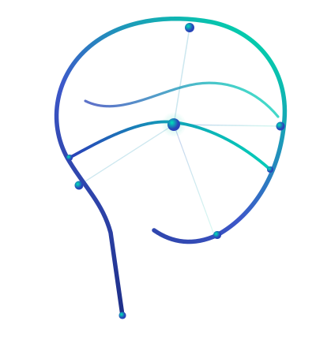
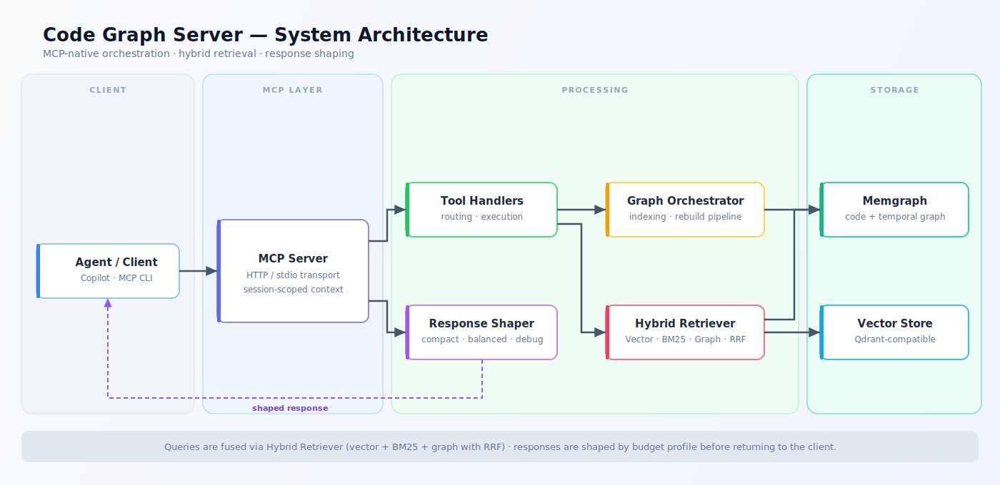
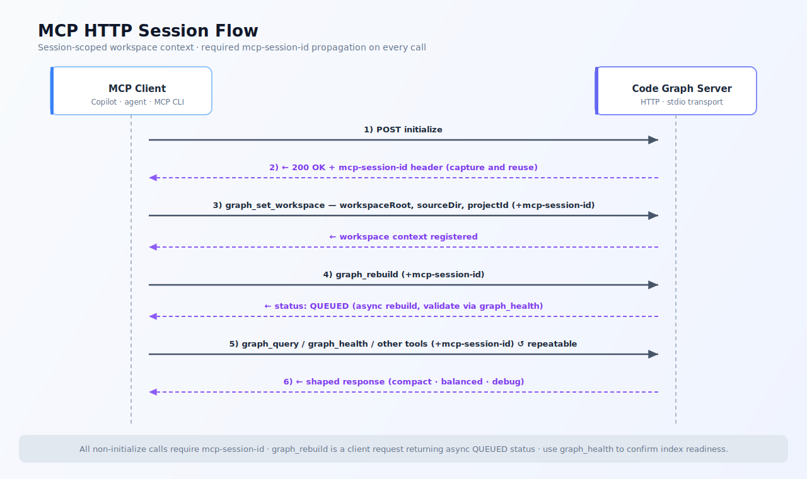

<div align="center">
  
  <h1>LexRAG MCP</h1>
  <p>A memory and code intelligence layer for software agents.</p>  
</div>


LexRAG Server is an MCP-native memory and code intelligence layer for software agents.

It turns your repository into a queryable graph + retrieval system so agents can answer architecture, impact, and planning questions without re-reading the entire codebase on every turn.

---

## At a glance

| Capability                  | What it enables                                             |
| --------------------------- | ----------------------------------------------------------- |
| **Code graph intelligence** | Cross-file dependency answers instead of raw file dumps     |
| **Agent memory**            | Persistent decisions/episodes across sessions               |
| **Hybrid retrieval**        | Better relevance for natural-language code questions        |
| **Temporal model**          | Historical queries (`asOf`) and change diffs (`diff_since`) |
| **MCP-native runtime**      | Works cleanly with editor and agent orchestration clients   |

## Why this exists

LLM agents often fail on real repositories for three reasons:

- They lose context between sessions.
- They spend tokens repeatedly scanning the same files.
- They lack structured, cross-file dependency memory.

Code Graph Server addresses this by combining:

- Graph structure (files, symbols, relationships)
- Temporal memory (episodes, decisions, claims)
- Hybrid retrieval (vector + lexical + graph expansion)
- MCP tools for deterministic, automatable workflows

## What you get

### 1) Code intelligence for agents

- Natural-language and Cypher graph querying
- Symbol-level explanation with dependency context
- Pattern and architecture rule validation
- Semantic code slicing for targeted line ranges

### 2) Agent memory and coordination

- Persistent episode memory (`observation`, `decision`, `edit`, `test_result`, `error`)
- Claim/release workflow to reduce multi-agent collisions
- Coordination views for active ownership and blockers

### 3) Delivery acceleration

- Test impact analysis and selective test execution
- Graph-backed progress/task tracking
- Context packs that assemble high-value context under token budgets

## Product architecture

Code Graph Server runs as an MCP server over stdio or HTTP and coordinates three data planes:

- **Graph plane (Memgraph)**: structural and temporal truth (FILE/FUNCTION/CLASS/IMPORT + relationships + tx history)
- **Vector plane (Qdrant-compatible flow)**: semantic retrieval for natural questions
- **Response plane**: answer-first shaping with profile budgets (`compact`, `balanced`, `debug`)

Retrieval for natural queries uses hybrid fusion:

1. Vector retrieval
2. BM25/lexical retrieval (optional Memgraph `text_search`, fallback lexical scorer)
3. Graph expansion
4. Reciprocal Rank Fusion (RRF)

### System diagram



## Tooling surface

The server exposes **33 MCP tools** across:

- Graph/querying (4): `graph_set_workspace`, `graph_rebuild`, `graph_health`, `graph_query`
- Code intelligence (5): `code_explain`, `find_pattern`, `semantic_slice`, `context_pack`, `diff_since`
- Architecture (2): `arch_validate`, `arch_suggest`
- Semantic/similarity (4): `semantic_search`, `find_similar_code`, `code_clusters`, `semantic_diff`
- Test intelligence (5): `test_select`, `test_categorize`, `impact_analyze`, `test_run`, `suggest_tests`
- Progress/operations (4): `progress_query`, `task_update`, `feature_status`, `blocking_issues`
- Memory/coordination (8): `episode_add`, `episode_recall`, `decision_query`, `reflect`, `agent_claim`, `agent_release`, `agent_status`, `coordination_overview`
- Runtime controls (1): `contract_validate`

## Quick start

### Prerequisites

- Node.js 24+
- Docker + Docker Compose
- Python 3 (for benchmark utilities)

### 1) Install and build

```bash
npm install
npm run build
```

### 2) Start infrastructure and server

```bash
docker-compose up -d
npm run start:http
```

Health endpoint:

```bash
npm run start:http
```

### 3) Required MCP HTTP session flow

Workspace context is session-scoped.

1. `initialize`
2. capture `mcp-session-id` response header
3. include `mcp-session-id` in all following calls for that client session
4. call `graph_set_workspace`
5. call `graph_rebuild`
6. query with `graph_query` / other tools

### MCP session flow diagram



### Visual examples

| Workflow                       | Minimal tool sequence                                  | Outcome                                        |
| ------------------------------ | ------------------------------------------------------ | ---------------------------------------------- |
| **Boot a project context**     | `initialize` → `graph_set_workspace` → `graph_rebuild` | Graph becomes query-ready for that MCP session |
| **Understand a subsystem**     | `graph_query` → `code_explain` → `semantic_slice`      | Dependency map + concrete code slice           |
| **Plan safe changes**          | `impact_analyze` → `test_select` → `test_run`          | Change radius + focused test execution         |
| **Coordinate multiple agents** | `agent_claim` → `context_pack` → `task_update`         | Ownership, task context, and durable progress  |

#### Example A — Set workspace context

```json
{
  "name": "graph_set_workspace",
  "arguments": {
    "workspaceRoot": "/workspace",
    "sourceDir": "src",
    "projectId": "my-repo"
  }
}
```

#### Example B — Natural graph query

```json
{
  "name": "graph_query",
  "arguments": {
    "query": "find key graph files",
    "language": "natural",
    "mode": "local",
    "limit": 5
  }
}
```

#### Example C — Context pack for an active task

```json
{
  "name": "context_pack",
  "arguments": {
    "task": "stabilize hybrid retrieval outputs",
    "taskId": "PHASE8-RET-01",
    "agentId": "agent-copilot",
    "profile": "compact"
  }
}
```

## Runtime modes

- **stdio**: best for local editor integrations and short-lived sessions
- **http**: best for multi-client agent fleets and remote orchestration

### UI/UX notes for GitHub readers

- Sections are ordered from value → architecture → quick start → operations.
- Diagrams provide an immediate mental model before command details.
- Badges provide a quick compatibility snapshot at first glance.

Scripts:

- `npm run start` (server entry)
- `npm run start:http` (HTTP supervisor)
- `npm run build`
- `npm test`

## Repository map

- `src/server.ts`, `src/mcp-server.ts`: MCP/HTTP surfaces
- `src/tools/tool-handlers.ts`: tool orchestration layer
- `src/graph/*`: graph client, orchestrator, retrieval, watcher
- `src/engines/*`: architecture/test/progress/community/episode logic
- `src/response/*`: response shaping, schemas, summarization
- `docs/AGENT_CONTEXT_ENGINE_PLAN.md`: implementation plan and phase status
- `docs/GRAPH_EXPERT_AGENT.md`: runbook and operator guidance

## Product status

All phases delivered and production-ready:

- Hybrid retrieval for natural `graph_query` (vector + BM25 + graph + RRF)
- AST-accurate multi-language parsers via tree-sitter (`CODE_GRAPH_USE_TREE_SITTER=true`)
- TypeScript, TSX, JavaScript (`.js`/`.mjs`/`.cjs`), JSX, Python, Go, Rust, Java
- Watcher-driven incremental rebuild processing
- Temporal query/diff support (`asOf`, `diff_since`)
- Indexing-time symbol summarization
- Optional Memgraph `text_search` BM25 path with safe fallback
- MAGE native Leiden community detection and PageRank PPR with graceful fallback
- SCIP IDs (`scipId` field) on all FILE, FUNCTION, and CLASS nodes
- Episode memory, agent coordination, context packs, response budget shaping

## Release highlights

Delivery milestones and user-facing impact:

- **Hybrid natural retrieval**: natural `graph_query` uses vector + lexical + graph fusion with RRF, giving better cross-file relevance.
- **Tree-sitter AST parsers**: TypeScript, TSX, JavaScript, JSX, Python, Go, Rust, and Java — activated via `CODE_GRAPH_USE_TREE_SITTER=true`, with per-language graceful fallback.
- **MAGE native algorithms**: Leiden community detection and PageRank PPR via `memgraph-mage`, with JS fallbacks for environments without MAGE.
- **SCIP IDs**: `scipId` field on all FILE, FUNCTION, and CLASS nodes enables precise cross-tool symbol references.
- **Lower-token answers**: indexing-time symbol summaries reduce payload size in compact workflows while keeping responses actionable.
- **Temporal analysis**: `asOf` and `diff_since` support historical reasoning and change auditing across graph state.
- **Always-fresh graph**: file watcher + changed-files incremental rebuilds reduce manual refresh loops and keep MCP answers current.
- **Safer retrieval fallback**: optional Memgraph BM25 `text_search` is used when available, with automatic lexical fallback to avoid runtime breaks.

## Benchmarks and quality gates

Benchmark and regression scripts are included under `scripts/` and `benchmarks/` to track:

- latency
- token efficiency
- accuracy trends
- compact-profile response budget compliance

Run regression checks:

```bash
npm run benchmark:check-regression
```

## Integration guidance

For best results with GitHub Copilot and other MCP clients:

- Set workspace each session with `graph_set_workspace`
- Rebuild incrementally after file changes (`graph_rebuild` or watcher)
- Use `profile: compact` for low-token autonomous loops
- Use `balanced/debug` when deeper payloads are needed

See:

- `.github/copilot-instructions.md`
- `docs/GRAPH_EXPERT_AGENT.md`

## License

MIT
